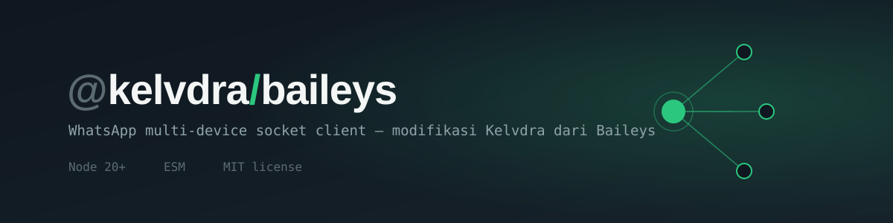

# @kelvdra/baileys

Fork [Baileys (WhiskeySockets)](https://github.com/WhiskeySockets/Baileys) yang dimodifikasi oleh **Kelvdra**: klien WhatsApp Web *multi-device* berbasis WebSocket (tanpa browser/Selenium), dengan tambahan fitur pesan interaktif, builder pesan, VoIP, dan sejumlah utilitas anti-ban / anti-memory-leak.


## Daftar Isi

- [Fitur](#fitur)
- [Instalasi](#instalasi)
- [Quick Start](#quick-start)
- [Contoh Fitur Tambahan](#contoh-fitur-tambahan)
- [Konfigurasi Opsional](#konfigurasi-opsional)
- [Struktur Project](#struktur-project)
- [Pengembangan & Testing](#pengembangan--testing)
- [Rilis](#rilis)
- [Dokumentasi Lengkap](#dokumentasi-lengkap)
- [Penafian](#penafian)
- [Lisensi & Kredit](#lisensi--kredit)

## Fitur

**Bawaan Baileys 7.x**
- Koneksi via QR code atau pairing code, multi-device, dukungan LID
- Kirim/terima pesan (teks, media, kontak, lokasi, reaksi, edit, hapus, poll, event)
- Grup, komunitas, newsletter/channel, profil, privasi, label, dan katalog bisnis
- Auth state & store yang bisa diganti (file, SQLite, Redis, MongoDB, MySQL, PostgreSQL)

**Tambahan dari Kelvdra**
- **Handler `hydra`** (`sock.kelvdra`): payment, product, interactive, album, event, poll result, carousel, order, sticker pack, status mention, dan group status. Di-*route* otomatis dari `sendMessage`.
- **Pesan interaktif**: `interactiveButtons`, tombol klasik, template button, list/sections, Native Flow, dan kartu **A2UI**.
- **Message Builder** (`MB`): `Button`, `ButtonV2`, `Carousel`, `AIRich`, `ORich`, `Toolkit`.
- **Album & Status**: `sendAlbumMessage`, `sendStatusMentions`.
- **HTML di dalam pesan** (`sock.sendHTML`): kirim halaman HTML/CSS/JS, tampil langsung di pesan atau lewat gelembung "Klik Aku" yang membuka layar.
- **Sticker pack** (`makeStickerPack`).
- **VoIP**: modul panggilan (`makeVoipClient`, `VoipClient`, `ActiveCall`, `AudioFeeder`, `VideoFeeder`).
- **Humanize**: jitter delay + presence *composing* agar pola kirim tidak seperti bot (opt-in).
- **Lite Store**: penyimpanan pesan/kontak/metadata grup dengan TTL dan batas ukuran (memory, SQLite, atau Redis).
- **LID → JID resolver**: `sock.getRealJid()` dan `sock.getLidForJid()` (aktif otomatis).
- **Custom Presence**, **MMG High-Res** (`sock.sendImageHd`), dan **Anti-Delay Upload** (cache + retry upload media).

## Instalasi

Persyaratan: **Node.js 20+** dan project berformat **ESM**.

```bash
npm install @kelvdra/baileys pino qrcode-terminal
```

Paket opsional (sesuai kebutuhan):

```bash
npm install sharp              # thumbnail gambar, konversi sticker pack
npm install jimp               # alternatif sharp
npm install link-preview-js    # link preview otomatis
npm install fluent-ffmpeg      # pemrosesan audio/video
npm install better-sqlite3     # auth state / lite store SQLite
npm install ioredis            # auth state / lite store Redis
npm install mongodb mysql2 pg  # auth state MongoDB / MySQL / PostgreSQL
```

Jika project kamu masih CommonJS, gunakan dynamic import:

```js
const { default: makeWASocket, useMultiFileAuthState } = await import('@kelvdra/baileys')
```

Sebagai pengganti `@whiskeysockets/baileys` lewat alias npm:

```json
{
  "dependencies": {
    "@whiskeysockets/baileys": "npm:@kelvdra/baileys@latest"
  }
}
```

## Quick Start

```js
import makeWASocket, {
  useMultiFileAuthState,
  DisconnectReason,
  fetchLatestWaWebVersion,
  makeCacheableSignalKeyStore,
  Browsers
} from '@kelvdra/baileys'
import pino from 'pino'
import qrcode from 'qrcode-terminal'

const logger = pino({ level: 'silent' })

async function start() {
  const { state, saveCreds } = await useMultiFileAuthState('session')
  const { version } = await fetchLatestWaWebVersion()

  const sock = makeWASocket({
    version,
    logger,
    browser: Browsers.ubuntu('Chrome'),
    auth: {
      creds: state.creds,
      keys: makeCacheableSignalKeyStore(state.keys, logger)
    }
  })

  sock.ev.on('creds.update', saveCreds)

  sock.ev.on('connection.update', ({ connection, lastDisconnect, qr }) => {
    if (qr) qrcode.generate(qr, { small: true })   // QR harus ditangani sendiri
    if (connection === 'open') console.log('Tersambung sebagai', sock.user?.id)
    if (connection === 'close') {
      const code = lastDisconnect?.error?.output?.statusCode
      if (code !== DisconnectReason.loggedOut) start()   // reconnect
      else console.log('Sesi logout. Hapus folder "session" lalu scan ulang.')
    }
  })

  sock.ev.on('messages.upsert', async ({ messages, type }) => {
    if (type !== 'notify') return
    const m = messages[0]
    if (!m.message || m.key.fromMe) return
    const teks = m.message.conversation || m.message.extendedTextMessage?.text || ''
    if (teks === '.ping') {
      await sock.sendMessage(m.key.remoteJid, { text: 'pong' }, { quoted: m })
    }
  })
}

start()
```

> **Catatan:** opsi `printQRInTerminal` sudah tidak mencetak QR. Tangani `update.qr` seperti contoh di atas, atau pakai pairing code.

### Pairing code (tanpa QR)

```js
if (!sock.authState.creds.registered) {
  const kode = await sock.requestPairingCode('6281234567890') // format internasional, tanpa "+"
  console.log('Kode pairing:', kode)
}
```

Jika memakai kode kustom (argumen ke-2), panjangnya harus tepat 8 karakter.

## Contoh Fitur Tambahan

**Tombol interaktif**

```js
await sock.sendMessage(jid, {
  text: 'Pilih menu',
  interactiveButtons: [
    {
      name: 'quick_reply',
      buttonParamsJson: JSON.stringify({ display_text: 'Halo', id: 'halo' })
    }
  ]
}, { quoted: m })
```

**Album (banyak foto/video sekaligus)**

```js
await sock.sendAlbumMessage(jid, [
  { image: { url: './a.jpg' }, caption: 'Foto 1' },
  { image: { url: './b.jpg' }, caption: 'Foto 2' }
])
```

**HTML di dalam pesan**

```js
// Mode langsung, HTML tampil di dalam pesan
await sock.sendHTML(ctx.chat, html, { text: 'Offline Sound Test' })

// Mode screen, gelembung "Klik Aku" yang membuka layar HTML
await sock.sendHTML(ctx.chat, html, { screen: true, title: 'Popioo Whack' })
```

`html` adalah string (atau Buffer) berisi HTML lengkap dengan CSS dan JavaScript. Opsi, batasan, dan contoh lengkap (Sound Test) ada di [docs/DOKUMENTASI.md, bagian 11.14](./docs/DOKUMENTASI.md#1114-html-di-dalam-pesan-sendhtml).

**Message Builder**

```js
import { MB } from '@kelvdra/baileys'
// MB.Button, MB.ButtonV2, MB.Carousel, MB.AIRich, MB.ORich, MB.Toolkit, MB.sendA2UI, ...
```

Contoh lengkap untuk payment, product, carousel, poll result, sticker pack, status mention, dan lainnya ada di [dokumentasi lengkap](./docs/DOKUMENTASI.md) dan [Native Flow & A2UI](./docs/README_nativeflow_a2ui.md).

## Konfigurasi Opsional

Semua opsi diberikan ke `makeWASocket({ ... })`.

**Humanize** (opt-in)

```js
const sock = makeWASocket({ /* ... */ humanize: true })
// atau
const sock = makeWASocket({ humanize: { minDelay: 1000, maxDelay: 3000, perCharMs: 20 } })

await sock.sendMessage(jid, { text: 'cepat' }, { humanize: false })  // lewati untuk satu pesan
sock.humanize.enabled = false                                         // matikan saat runtime
```

**Lite Store**

```js
import { makeLiteStore, memoryBackend, sqliteBackend, redisBackend } from '@kelvdra/baileys'

const store = makeLiteStore({ backend: await sqliteBackend({ path: './store.db' }) })
// atau memoryBackend({ max: 5000 }) / redisBackend({ url })
store.bind(sock.ev)

const sock = makeWASocket({ getMessage: store.getMessage })
```

**LID → JID resolver** (aktif otomatis, matikan dengan `jidResolver: false`)

```js
const jid = await sock.getRealJid(m.key.participant, { groupJid: m.key.remoteJid, message: m })
const lid = await sock.getLidForJid('62812xxxx@s.whatsapp.net')
```

**Custom Presence, MMG High-Res, Anti-Delay Upload**: lihat [docs/README_fitur_tambahan.md](./docs/README_fitur_tambahan.md).

## Struktur Project

```
.
├── package.json
├── engine-requirements.js        # cek Node >= 20
├── banner.svg
├── WAProto/                      # definisi protobuf WhatsApp
├── docs/
│   ├── README_nativeflow_a2ui.md # Native Flow & kartu A2UI
│   └── README_fitur_tambahan.md  # Custom Presence, MMG, Anti-Delay Upload
├── test/
│   ├── features.test.js
│   └── voip.test.js
├── .github/workflows/main.yml    # publish otomatis ke npm saat push tag v*
└── lib/
    ├── index.js                  # entry point
    ├── Defaults/                 # konfigurasi & konstanta default
    ├── MessageBuilder/           # Button, Carousel, AIRich, dll (MB)
    ├── Signal/                   # enkripsi Signal, LID mapping
    ├── Socket/                   # socket, chats, groups, communities, newsletter,
    │                             # business, messages-send/recv, hydra
    ├── Store/                    # in-memory store, lite store, cache-manager
    ├── Types/                    # definisi TypeScript
    ├── Utils/                    # auth state, media, humanizer, jid-resolver,
    │                             # custom-presence, mmg, upload-cache, sticker-pack, dll
    ├── VoIP/                     # klien panggilan suara/video
    ├── WABinary/                 # encode/decode node biner WhatsApp
    ├── WAM/ · WAUSync/           # analitik & query USync
    └── assets/wasm/
```

## Pengembangan & Testing

```bash
corepack enable
yarn install

# jalankan test bawaan Node
node --test test/
```

## Rilis

Publish ke npm berjalan otomatis lewat GitHub Actions ketika tag berawalan `v` di-push:

```bash
# naikkan "version" di package.json terlebih dahulu
git tag v1.0.6
git push origin v1.0.6
```

## Dokumentasi Lengkap

| Dokumen | Isi |
|---|---|
| [docs/DOKUMENTASI.md](./docs/DOKUMENTASI.md) | Referensi lengkap: konfigurasi, event, semua tipe pesan, API grup/komunitas/newsletter, store, dan masalah yang diketahui |
| [docs/README_nativeflow_a2ui.md](./docs/README_nativeflow_a2ui.md) | Tombol Native Flow dan kartu A2UI |
| [docs/README_fitur_tambahan.md](./docs/README_fitur_tambahan.md) | Custom Presence, MMG High-Res, Anti-Delay Upload |

## Penafian

Proyek ini tidak berafiliasi, disponsori, atau didukung oleh WhatsApp maupun Meta. Gunakan dengan tanggung jawab dan patuhi Ketentuan Layanan WhatsApp; penggunaan untuk spam, penipuan, atau pelecehan dapat menyebabkan akun diblokir. Protokol WhatsApp dapat berubah sewaktu-waktu sehingga sebagian fitur bisa berhenti berfungsi tanpa pemberitahuan.

## Lisensi & Kredit

Dilisensikan di bawah [MIT](./LICENSE).

- Basis kode: [Baileys / WhiskeySockets](https://github.com/WhiskeySockets/Baileys) oleh Rajeh Taher dan kontributor
- Modifikasi & fitur tambahan: **Kelvdra**
- Kontak & dukungan: Telegram [t.me/kelvdraa](https://t.me/kelvdraa)
